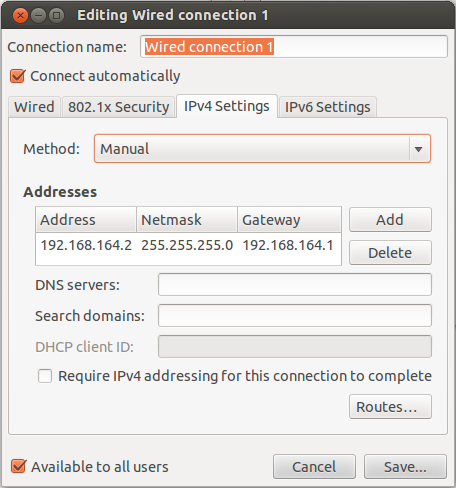

# 基于netfilter的防火墙系统
　　本防火墙基于netfilter实现，测试运行环境为Ubuntu12.04系统版本，内核版本：3.13.0-32-generic。实现了规则匹配，状态连接列表，动态nat转换，日志查询等功能。提供了应用程序界面以及命令行两种版本的用户程序。</br>
　　　　　　　　　　　　　　　　　　　　　　　　　　　　　　　　　　　----2019年10月30日 作者：冯冠云
## 使用方式
　　在这里首先介绍如何部署及使用本防火墙中的代码。<br>
　　要完成本实验共需要三台虚拟机(系统版本Ubuntu12.04，内核版本：3.13.0-32-generic)，分别为内网主机，防火墙，外网主机。代码仅部署在充当防火墙的虚拟机中,但为了方便进行实验验证，我们仍需要在内网主机与外网主机中进行一定的设置。安装虚拟机的过程已经略去，虚拟机镜像下载地址：[华科镜像源Ubuntu12.04](http://mirror.hust.edu.cn/ubuntu-releases/12.04/ubuntu-12.04.5-desktop-amd64.iso)。<br>
### VMWARE添加虚拟网卡
　　运行VMWARE，编辑->虚拟网络编辑器->更改设置。添加虚拟网卡VMnet2(192.168.164.0/24)和VMnet3(192.168.152.0/24)。添加后的配置如下：<br><br>
 　　　　　　　　　　<br><br>
　　“右键虚拟机->设置->添加->网络适配器“可以为虚拟机添加网卡。内网主机添加虚拟网卡VMnet2，外网主机添加虚拟网卡VMnet3，防火墙添加VMnet2和VMnet3两个网卡。添加完成后三台虚拟机的网络拓扑图如下：<br>
<br><br>

### 内网主机配置
　　进入内网主机对应的虚拟机系统，点击右上角设置标志，"system setting->Network->options->IPv4 Settings"设置静态ip地址为：`192.168.164.2`，并将其网关设置为`192.168.164.1`。设置如下：<br><br>
 　　　　　　　　　 　　　　　　　<br><br>
　　安装apache，开启web服务。并可以通过修改`/var/www/index.html`来修改网页的内容。安装完成后打开浏览器，访问127.0.0.1，如果能正常访问，说明web服务已经开启。命令如下：
```
sudo apt-get install apache2
sudo /etc/init.d/apache2 start
```
### 外网主机配置
　　类似内网主机虚拟机的设置，设置静态ip:`192.168.152.2`，并将网关设置为`192.168.152.1`。安装并开启web服务。

### 防火墙主机配置
　　首先开启防火墙转发功能，使用命令`sudo echo 1 > /proc/sys/net/ipv4/ip_forward`开启该功能。开启后测试内网主机(192.168.164.2)是否可以ping通外网主机(192.168.152.2)如果可以，说明目前为止配置没有问题。

#### 内核模块安装
将myfw文件夹拷贝到防火墙虚拟机中，执行以下命令：
```
cd myfw
make clean
make
sudo insmod myfw.ko
```
#### 运行用户程序
